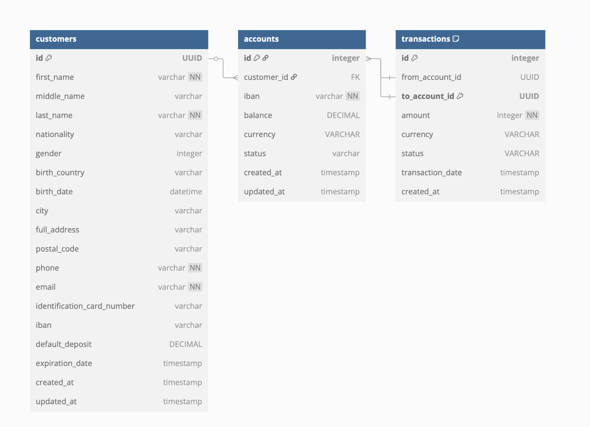

<h4>Goal:</4>
- Build an internal API for a fake financial institution

<h4> Basic workflow to implement this backend API services</h4>


<hr>
<i>Required data entities UML for helping processing business logic. </i>


<h4> Thinking process:</h4>
<hr>
<b>Designning componments:</b>
<ul>
    <li>
        Build functional API endpoints so that can be manage customer creation, customer bank account creation and customer transaction, be it transaction history retriveal and account balance retrival. Three main entities `customers`, `bank_accounts`, `transactions` will be used. (This is `CURD-like API`, I currently list the patch, delete, etc endpoints in routes/customers.py), I will implment in the end phase based on the timeframe.
    </li>
    <li>
        To implement this features, currently I used the tach stacks are FastAPI, Pydantic, PostgreSQL, SQLAlchemy(ORM), Poetry, Pytest in Python ecosystem.
    </li>
    <li>
        I do have few concerns and later design before this need go to production or even testing in staging internally.
            <ol>
                <li>
                For how to store passwords, I currently will not save customer bank password in database, for data security, for full functionality or integration with external vendor system, need store encrypted/hashed password in a seperate table.
                </li>
                <li>
                For the Docker and CICD yml file, need to implement.
                </li>
                <li>
                For auth& authorization, this is normally the first step when building APIs or web apps, I will implement this based on time frame.
                </li>
                <li>
                To store customer documentaion, need implement using cloud storage, be it GCP. (Will skip for this task scope).
                </li>
        </ol>
    </li>
</ul>

<hr>


<h4> Set up </h4>
config database info in the `.env` for environment variable usage for data model creation and database query operations. (I skipped add `.env` file in git repo.)
But, just config locally for sqlalchemy_url is sufficient.

```bash
poetry install 
poetry env activate 
poetry run uvicorn bankAPI.main:app --reload
http://localhost:8000/docs

http://localhost:8000/redoc

#or docker 
docker build -t bankapi . 
docker run -d -p 8080:8080 --name bankapi bankapi
```

<h4> Additions:</h4>
    <ul>
        <li>
            How to prevent that two customers that transfer to the same customer, for example customer B, C transfer to customer A, and this happen at the same time.
        </li>
        <li>
            What the better structure to use especially in banking, some data should be immutable.
        </li>
        <li>
            For the PII data, need implement tokenization or mask technique.
        </li>
        <li>
            For some data, we need check if follow the GDPR compliant, etc.
        </li>
        <li>
            For this task only for internal usage, but in production or integrate with external systems, will need add whitelisten, only allow certain IP access.
        </li>
        <li>
            To be production-ready, I also write more unittest and document more test scenarios and invariant checking based on banking logic.
        </li>
        <li>
            Set up telemetry, be it openTelemetry or pydantic tool logfire. or using grafana and other tool to check logs. I will implement the `logfire` and used the basic functionlity for API monitoring.
        </li>
    </ul>


<h2> Test sceanrios</h2>


<h4>Test documentation</h4>
<h4> Customers endpoint test</h4>
<h6>Create a new customer.</h6>


<h6>Check the first customer in database `customers` table.</h6>


<h6>Same customer can't create a new customer account twice in system.</h6>
(<i>Criteria of the same customer: with either the same email or phone number </i>)


<h6>Default deposit should be positive.</h6>


<h6>Create a second customer for testing usage.</h6>


<h6>Check the 2nd customer in database `customers` table.</h6>


<h4>Updated version of customer creation endpoint:</h4> <div><b>Final version of Customer creation endpoint.</b>

```bash
Request: 
http://localhost:8000/customers/add?iban=DE05159460605970714359&default_deposit=20&currency=EUR

Response:
NFO: 127.0.0.1:52364 - "POST /customers/add?iban=DE05159460605970714359&default_deposit=20&currency=EUR HTTP/1.1" 201 Created
```


<h6>Check new created customer in `customers` table and new main account in `accounts` table.</h6>


<h4>Accounts endpoint test</h4>
<h6>Create a new account.</h6>
- An account can't be crated if customer (info) is not existed.


<h6>Create a new account if customer (info) is existed.</h6>
existed_customer_email: `email: "reality1800@yahoo.com"`


<h6>Retrive account balance by bank_id(`IBAN`).</h6>


<h6>Retrieve bank account balance using: bank_id: `DE13504952221857054435`</h6>


<h4>Transaction between two accounts(Two main scenarios and each scenarios has binary cases.)</h4>

<h6><b>Two accounts under the same customer: Success</b></h6>


<h6><b>Two accounts under the same customer: Fail(because insufficient funds)</b></h6>


<h6><b>Two accounts under two different customers: Success</b></h6>


<h6><b>Two accounts under two different customers: Fail(because insufficient funds)</b></h6>


<hr>

Above two transaction records as shown in current `transactions` table


The amount changes between two account in `accounts` table.
(below is the test that transafer between two accounts and chnages in database. Attaching the latest `bank_accounts` table)


<hr>

<h4>Update for transaction between two accounts. </h4>

Transfer between accounts: (`"DE13504952221857054412"`,`"DE13504952221857054439"`)

- Transaction Failure case: (Insufficient funds).


- Transaction Success case.


After submiting transaction successfully, both sender and receiver account balance are reflected as shown below. (Currently not consider the Currency, else the balance will be adjusted by its currency rate. In the future for production ready, need implement in-house or integrate with external currency rates API or services for fetching dynamic currency interests.)


<h4> Transactions endpoint test </h4>
- Retrieve transaction history by bank_id(`IBAN`).
```bash
Retrieved transactions: <sqlalchemy.engine.result.ScalarResult object at 0x1055198b0>
INFO: 127.0.0.1:50086 - "GET /accounts/transaction_history?bank_id=DE13504952221857054432 HTTP/1.1" 200 OK
````

